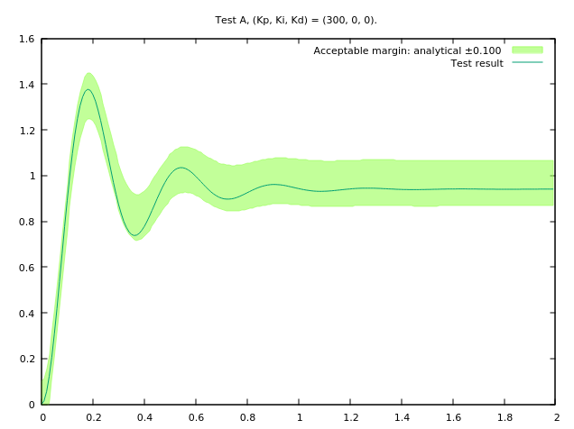
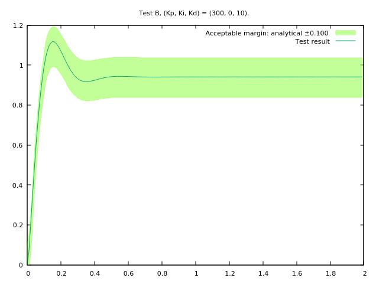
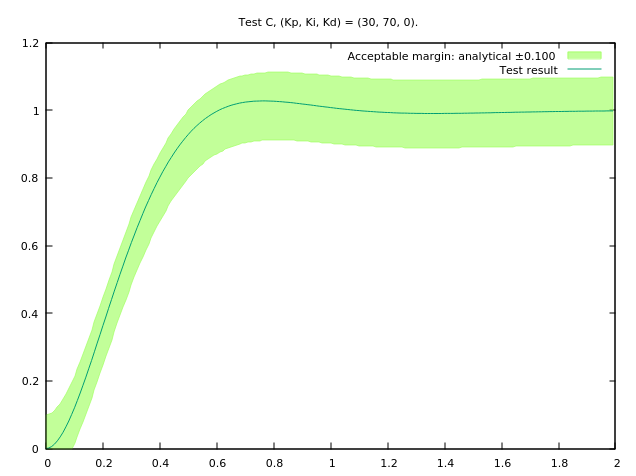
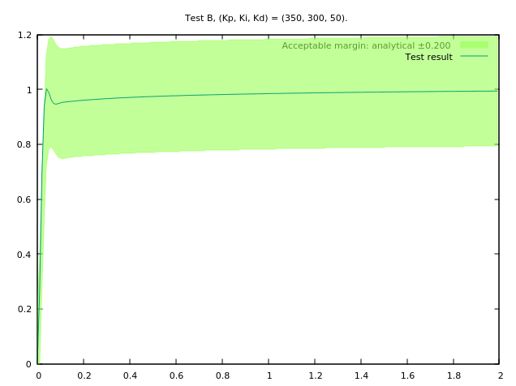

# `pid-unfolding`

***Warning:*** *this is a work in progress.*

Playing with PID control as a corecursion in juxtaposition to Brian Beckman's Kalman folding [^kf-1] [^kf-2] [^kf-4].

The categorical dual of a functional *fold* is *unfold*. Since control and estimation are, at least in some senses, dual operations, I thought it would be interesting to implement a controller as an *anamorphism* (unfold) having already implemented a Kalman filter as a catamorphism ([click here](https://github.com/timtro/kalman-folding/)). I have also written the controller into a Functional Reactive Programming (FRP) network, but that particular implementation isn't obviously (or isn't at all) an anamorphism, because the entry of new states into the network exposes the recursion scheme in a way that breaks its mathematical clarity.

***NB:*** I am extending this technique to control systems in general, and nonlinear model predictive control in particular. Check back soon for repositories exhibiting that research.

(To download Dr. Beckman's papers, and see others in the series, [click here](http://vixra.org/author/brian_beckman).)

## Overview

In this code, a PID controller is implemented, and its step response is tested against analytical results. As a starting off point, I used the examples [here](http://ctms.engin.umich.edu/CTMS/index.php?example=Introduction&section=ControlPID) so that I could have an independent source with which to cross reference my results. However, I worked out analytical solutions to those problems to use in my unit tests. The rest results are plotted and illustrated below.

## Organisation

Everything herein is written as unit-test (using [Catch2](https://github.com/catchorg/Catch2)). Actual unit tests are in `test/`, while the main event is in `/src`.

The logic for the pid controller is in `include/pid.hpp`. The plant is in `include/Plant.hpp`.

The math to get the analytical results for use in the `src/` tests is in `src/calculations`. It will require Octave/MATLAB and wxMaxima to open.

## Dependencies:
 * CMake
 * [Catch2](https://github.com/catchorg/Catch2)
 * [Eigen3](ihttp://eigen.tuxfamily.org/index.php?title=Main_Page) (Debian/Ubuntu: `sudo apt install libeigen3-dev`)
 * [Boost.Hana](https://www.boost.org/doc/libs/1_61_0/libs/hana/doc/html/index.html) (only for Currying, I'll probably eliminate this dependency if anyone asks.)
 * [Sodium-C++](https://github.com/SodiumAFRP/sodium-cxx) (for the functional reactive programming implementation)
 * [Gnuplot](http://gnuplot.sourceforge.net/) (if you use `cmake -DWITH_PLOT=on`)

[^kf-1]: Brian Beckman, Kalman Folding-Part 1. (2016)

[^kf-2]: Brian Beckman, Kalman Folding 2: Tracking and System Dynamics. (2016)

[^kf-4]: Brian Beckman, Kalman Folding 4: Streams and Observables. (2016)

[^Z&M]: Zarchan and Musoff, Fundamentals of Kalman Filtering: A Practical Approach. 4th Ed. Ch 4.
